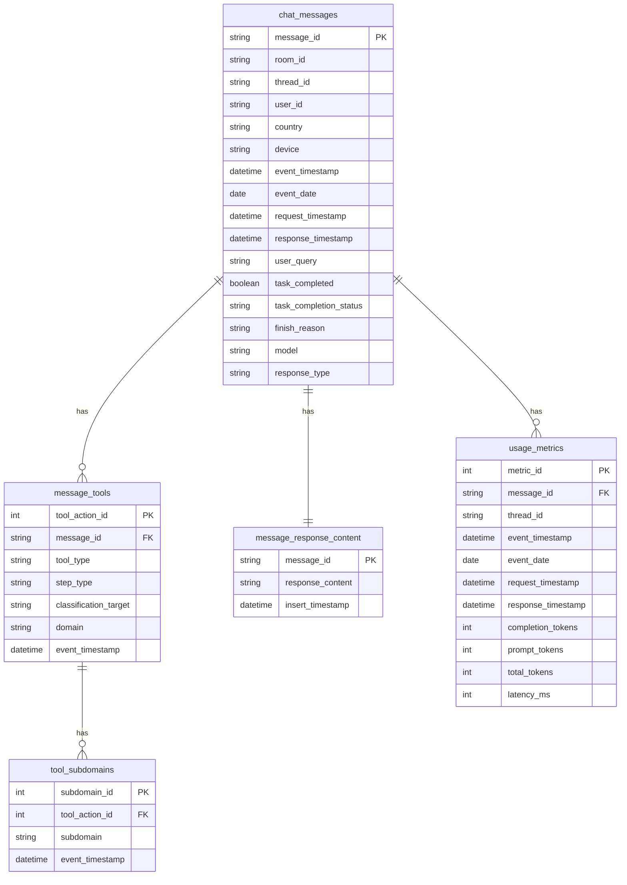

# Entity-Relationship (ER) Diagram
## Redshift Chat Analytics Schema

This document provides an Entity-Relationship diagram of the Redshift schema for chat analytics, including the intent classifier workflow with domain/subdomain classification and support for multiple subdomains per message.

---

## Mermaid ER Diagram



---

## Text-Based ER Diagram

```
┌─────────────────────────────────────────────────────────────────────────┐
│                         CHAT ANALYTICS SCHEMA                           │
│                         Entity-Relationship Diagram                      │
└─────────────────────────────────────────────────────────────────────────┘

┌─────────────────────────────────────┐
│        chat_messages                │ ◄───────┐
│  ─────────────────────────────────  │         │ One-to-Many
│ PK message_id (PRIMARY KEY)        │         │
│    room_id (many-to-one)           │         │
│    thread_id (many-to-one)         │         │
│    user_id (many-to-one)           │         │
│    country (for filtering)         │         │
│    device (for filtering)          │         │
│    event_timestamp (Sort Key)      │         │
│    event_date (for DAU/WAU/MAU)    │         │
│    request_timestamp               │         │
│    response_timestamp              │         │
│    user_query (Intent Input)       │         │
│    task_completed                  │         │
│    task_completion_status          │         │
│    finish_reason                   │         │
│    model                           │         │
│    response_type                   │         │
│                                     │         │
│ Note: user_id, country, device      │         │
│ for DAU/WAU/MAU and filtering       │         │
└─────────────────────────────────────┘         │
         │                                        │
         │ 1:N (one-to-many)                     │
         ▼                                        │
┌─────────────────────────────────────┐         │
│   message_tools                     │ ────────┼───────┐
│  ─────────────────────────────────  │         │       │ Multiple Tools
│ PK tool_action_id                  │         │       │ Per Message
│ FK message_id                      │         │       │
│    tool_type (Source of Truth)     │         │       │
│    step_type (Source of Truth)     │         │       │
│    classification_target            │         │       │
│    domain (Source of Truth)         │         │       │
│    event_timestamp                  │         │       │
│                                     │         │       │
│ Note: Junction table - one row     │         │       │
│ per tool action. Domain per tool.  │         │       │
└─────────────────────────────────────┘         │       │
         │                                       │       │
         │ 1:N (one-to-many)                    │       │
         ▼                                       │       │
┌─────────────────────────────────────┐         │       │
│   tool_subdomains                   │ ────────┼───────┐
│  ─────────────────────────────────  │         │       │ Multiple Subdomains
│ PK subdomain_id                    │         │       │ Per Tool
│ FK tool_action_id                  │         │       │
│    subdomain (Source of Truth)     │         │       │
│    event_timestamp                  │         │       │
│                                     │         │       │
│ Note: Junction table - one row     │         │       │
│ per subdomain per tool              │         │       │
└─────────────────────────────────────┘         │       │
         │                                       │       │
         │ 1:1                                   │       │
         ├───────────────────────────────────────┘       │
         │                                               │
         │ 1:1                                          │
         ▼                                               │
┌─────────────────────────────────────┐                 │
│   message_response_content          │                 │
│  ─────────────────────────────────  │
│ PK message_id (1:1)                │
│    response_content (Large TEXT)   │
│    insert_timestamp                │
└─────────────────────────────────────┘                 │
         │                                       │       │
         │ Optional FK (many-to-one)            │       │
         ▼                                       │       │
┌─────────────────────────────────────┐                 │
│      usage_metrics                  │                 │
│  ─────────────────────────────────  │                 │
│ PK metric_id                       │                 │
│ FK message_id (Optional)           │                 │
│    thread_id (many-to-one)         │                 │
│    event_timestamp (Sort Key)      │                 │
│    request_timestamp               │                 │
│    response_timestamp              │                 │
│    completion_tokens                │                 │
│    prompt_tokens                    │                 │
│    total_tokens                     │                 │
│    latency_ms                      │                 │
│    event_date (denormalized)        │                 │
└─────────────────────────────────────┘                 │
                                                        │
                                                        └─────────────────────┘
```

---

## Intent Classifier Workflow

```
┌─────────────────────────────────────────────────────────────────┐
│                    INTENT CLASSIFIER WORKFLOW                  │
│              (Multiple Subdomains Per Message Support)           │
└─────────────────────────────────────────────────────────────────┘

1. RAW DATA (from topic message)
   └─> reasoning_steps[] array
        │
        ▼
2. INSERT INTO chat_messages
   ├─ user_query (from request_body.messages[0].content)
   ├─ tool_type (from Glue classifier selection)
   ├─ step_type (from selected reasoning step)
   └─ Other message metadata
        │
        ▼
3. INTENT CLASSIFIER (Stage 1: Tool Routing)
   ├─ Input: tool_type + step_type (from reasoning_steps[])
   ├─ Process: Classification logic
   └─ Output: classification_target
        │
        ├─ tool_type = 'web_search'
        │   └─> UPDATE chat_messages SET classification_target='web_search'
        │
        ├─ tool_type = 'browser_tool_execution'
        │   ├─ IF step_type = 'ENTROPY_REQUEST'
        │   │   └─> UPDATE chat_messages SET classification_target='web_automation'
        │   └─ ELSE
        │       └─> UPDATE chat_messages SET classification_target='browser_automation'
        │
        └─ tool_type = 'agent_progress'
            ├─ IF step_type = 'ENTROPY_REQUEST'
            │   └─> UPDATE chat_messages SET classification_target='web_automation'
            └─ ELSE
                └─> UPDATE chat_messages SET classification_target='none' (planning/reasoning only)

4. INTENT CLASSIFIER (Stage 2: Domain/Subdomain Classification)
   ├─ Input: user_query (from chat_messages.user_query)
   ├─ Process: Analyze user_query to identify intents
   └─ Output: domain + subdomain(s) (can be multiple intents)
        │
        ├─ Example: "order food and schedule delivery"
        │   └─> UPDATE chat_messages SET domain='Transactional'
        │   └─> INSERT INTO tool_subdomains (message_id, subdomain='food_order')
        │   └─> INSERT INTO tool_subdomains (message_id, subdomain='delivery')
        │
        ├─ Example: "book a hotel room"
        │   └─> UPDATE chat_messages SET domain='Transactional'
        │   └─> INSERT INTO tool_subdomains (message_id, subdomain='booking')
        │
        └─ Example: "search for restaurant reviews"
            └─> UPDATE chat_messages SET domain='Informational'
            └─> INSERT INTO tool_subdomains (message_id, subdomain='restaurant_info')

5. STORAGE
   └─ All tool classification fields stored in chat_messages
       ├─ tool_type, step_type, classification_target, domain (SOURCE OF TRUTH)
       └─ Individual subdomains stored in tool_subdomains table (one row per subdomain)
       Note: domain calculated from chat_messages.user_query and stored in chat_messages
       Note: subdomains calculated from chat_messages.user_query and stored in tool_subdomains
```

---

## Relationship Summary

### Core Relationships:

1. **chat_messages** → **message_tools** (1:N)
   - One message can have multiple tool records (one row per tool)
   - FK: `message_tools.message_id` → `chat_messages.message_id`
   - **Multiple Tools**: Each tool action stored as a separate row (normalized structure)
   - **Tool Classification**: `tool_type`, `step_type`, `classification_target`, `domain` stored in `message_tools` (SOURCE OF TRUTH)
   - **Domain Per Tool**: Each tool can have its own domain classification
   - **Example**: A message with web_search + browser_automation + web_automation creates three rows in `message_tools`, each with its own domain

2. **message_tools** → **tool_subdomains** (1:N)
   - One tool can have multiple subdomain records (one row per subdomain per tool)
   - FK: `tool_subdomains.tool_action_id` → `message_tools.tool_action_id`
   - **Multiple Subdomains Per Tool**: Each subdomain intent stored as a separate row (normalized structure)
   - **Subdomain**: Calculated by intent classifier and stored in `tool_subdomains` (SOURCE OF TRUTH)
   - **Domain**: Domain is stored in `message_tools` table (tool-level classification, join required for domain+subdomain queries)

3. **chat_messages** → **message_response_content** (1:1)
   - One message has exactly one response content (or NULL)
   - FK: `message_response_content.message_id` → `chat_messages.message_id` (PRIMARY KEY)
   - **Best Practice**: Large content separated for performance

4. **chat_messages** → **usage_metrics** (1:N, optional)
   - One message can have multiple usage metric records (optional FK)
   - FK: `usage_metrics.message_id` → `chat_messages.message_id` (optional)
   - Many metrics can belong to one thread_id (many-to-one relationship)

---

## Key Design Features

### Distribution Keys (DISTKEY):
- All fact tables: **EVEN distribution** (explicitly declared with `DISTSTYLE EVEN`)
  - `thread_id` and `room_id` have low cardinality (many messages per thread/room), not suitable for distribution
  - `message_id` is VARCHAR, not suitable for DISTKEY

### Sort Keys (SORTKEY):
- Time-series tables: `event_timestamp` as first sort key
- Composite sort keys for common query patterns:
  - `chat_messages`: `SORTKEY(event_timestamp, user_id)` (optimized for DAU/WAU/MAU queries)
  - `message_tools`: `SORTKEY(message_id, tool_type)` (for joins and tool filtering)
  - `tool_subdomains`: `SORTKEY(tool_action_id, subdomain)` (for joins with message_tools and filtering)
  - `usage_metrics`: `SORTKEY(event_timestamp, thread_id)`
  - `message_response_content`: `SORTKEY(message_id)`

### Intent Classifier Integration:
- **Source**: `chat_messages.user_query` (input for intent classifier)
- **Classification Basis**: Based on `response_body`, `step_type`, and `tool` fields from JSON
- **Multiple Tools Per Message**: A single message can have MULTIPLE tools (e.g., web_search + browser_automation + web_automation) - stored in normalized `message_tools` junction table (one row per tool)
- **Domain Per Tool**: Each tool in `message_tools` can have its own domain classification (tool-level, not message-level)
- **Multiple Subdomains Per Tool**: ONE tool can have MULTIPLE subdomain intents (stored in normalized `tool_subdomains` junction table - one row per subdomain per tool)
- **Two-Stage Classification**:
  1. **Tool Routing**: Based on `tool_type` and `step_type` combination (for each tool in reasoning_steps[])
     - For each tool in reasoning_steps[], determine classification_target:
       - `tool_type='web_search'` → `classification_target='web_search'` → stored in `message_tools`
       - `tool_type='browser_tool_execution' AND step_type != 'ENTROPY_REQUEST'` → `classification_target='browser_automation'` → stored in `message_tools`
       - `tool_type='browser_tool_execution' AND step_type='ENTROPY_REQUEST'` → `classification_target='web_automation'` → stored in `message_tools`
       - `tool_type='agent_progress' AND step_type='ENTROPY_REQUEST'` → `classification_target='web_automation'` → stored in `message_tools`
       - `tool_type='agent_progress' AND step_type != 'ENTROPY_REQUEST'` → `classification_target='none'` → stored in `message_tools`
     - **Key Rule**: `step_type='ENTROPY_REQUEST'` always routes to `classification_target='web_automation'` (actual web action)
     - **Multiple Tools**: All tools from reasoning_steps[] are stored in `message_tools` (one row per tool)
  2. **Domain/Subdomain Classification**: Based on `user_query` analysis (per tool)
     - Intent classifier analyzes `user_query` from `chat_messages.user_query` for each tool
     - Outputs `domain` (e.g., 'Transactional', 'Informational', 'Entertainment', 'Productivity') → stored in `message_tools` (tool-level, one domain per tool)
     - Outputs `subdomain`(s) (e.g., 'food_order', 'delivery' for multiple intents, 'shopping', 'booking' for single intent) → stored in `tool_subdomains` (one row per subdomain per tool)
     - **Multiple Intents Support**: Can identify and store multiple subdomain intents as separate rows in `tool_subdomains` (e.g., 'food_order' and 'delivery' as two separate rows for the same tool)
     - `domain` stored directly in `message_tools` (SOURCE OF TRUTH - tool-level)
     - `subdomain` values stored in `tool_subdomains` (SOURCE OF TRUTH - one row per subdomain per tool)
- **Tracking**: `tool_type`, `step_type`, `classification_target`, `domain` in `message_tools` (SOURCE OF TRUTH), `subdomain` in `tool_subdomains` (SOURCE OF TRUTH)

---

## Notes

1. **Foreign Key Constraints**: Redshift doesn't enforce FK constraints, but relationships are maintained logically through ETL

2. **Tool/Tool Classification Storage**: 
   - `tool_type`, `step_type`, `classification_target`, `domain` are stored in `message_tools` junction table (SOURCE OF TRUTH) - one row per tool
   - A single message can have multiple tools (e.g., web_search + browser_automation + web_automation)
   - Each tool can have its own domain classification (tool-level, not message-level)
   - Normalized structure enables better querying and analytics on individual tools

3. **Domain/Subdomain Storage**: 
   - `domain` is stored in `message_tools` (SOURCE OF TRUTH) - tool-level classification, each tool can have its own domain
   - `subdomain` values are stored in `tool_subdomains` junction table (SOURCE OF TRUTH) - one row per subdomain per tool
   - Calculated by intent classifier from `chat_messages.user_query` (analyzed per tool)
   - Normalized structure enables better querying and analytics on individual subdomains per tool

4. **ETL Workflow**: 
   - Insert into `chat_messages` first (with user_id, country, device, event_date)
   - Insert into `message_tools` for each tool in reasoning_steps[] (one row per tool)
   - Intent classifier runs after `message_tools` insert, calculating domain per tool and subdomains per tool from `user_query`, updating `message_tools.domain` and inserting into `tool_subdomains`

5. **Domain/Subdomain Classification**: Done by intent classifier analyzing `user_query` from `chat_messages.user_query`, NOT via table lookup

6. **Multiple Tools Per Message**: A single message can have MULTIPLE tools - all tools from reasoning_steps[] are stored in `message_tools` (one row per tool)

7. **Multiple Subdomains Per Message**: ONE tool_type can have MULTIPLE intents in a single message - stored in normalized `tool_subdomains` junction table (one row per subdomain, e.g., 'food_order' and 'delivery' as separate rows)

8. **Source of Truth**: 
   - `message_tools.tool_type`, `message_tools.step_type`, `message_tools.classification_target`, `message_tools.domain` are the SOURCE OF TRUTH for tool classification (one row per tool, domain per tool)
   - `tool_subdomains.subdomain` is the SOURCE OF TRUTH for individual subdomains (one row per subdomain per tool)
   - Calculated from `chat_messages.user_query` by intent classifier (analyzed per tool)

8. **Large Content Separation**: `message_response_content` separated from `chat_messages` for performance (Redshift best practice)

9. **EVEN Distribution**: Explicitly declared with `DISTSTYLE EVEN` - `thread_id` and `room_id` have low cardinality, not suitable for distribution

10. **Relationship Fields**: `thread_id`, `room_id`, and `user_id` are NOT unique identifiers of a message - they are relationship fields (many messages can belong to one thread/room/user)

11. **Normalized Tool Schema**: Tool classification fields (`tool_type`, `step_type`, `classification_target`, `domain`) are stored in `message_tools` junction table to support multiple tools per message. This enables a single message to have multiple tools (e.g., web_search + browser_automation + web_automation), each with its own domain classification.

12. **DAU/WAU/MAU Support**: `user_id`, `country`, `device`, and `event_date` fields in `chat_messages` enable efficient DAU/WAU/MAU calculations and geographic/device filtering. SORTKEY optimized with `user_id` for user-level queries.

13. **Junction Table for Subdomains**: `tool_subdomains` is a normalized junction table that stores one row per subdomain intent per tool. Links to `message_tools` via `tool_action_id` (not `message_id`). This enables better querying and analytics on individual subdomains per tool compared to comma-separated values.

14. **Thread-Level Support**: Schema fully supports thread-level message counts. Query: `SELECT thread_id, COUNT(*) FROM chat_messages GROUP BY thread_id`

15. **User-Level Support (DAU/WAU/MAU)**: Schema supports user-level aggregations and DAU/WAU/MAU calculations via `user_id` field (in SORTKEY for optimal performance). Query: `SELECT COUNT(DISTINCT user_id) FROM chat_messages WHERE event_date = CURRENT_DATE` (DAU)

16. **Geographic and Device Filtering**: `country` and `device` fields enable geographic and device-level analytics. Query: `SELECT country, COUNT(DISTINCT user_id) FROM chat_messages WHERE event_date = CURRENT_DATE GROUP BY country` (DAU by country)

17. **Denormalized event_date**: `chat_messages` and `usage_metrics` include `event_date` (denormalized from `event_timestamp`) to avoid `DATE()` function in queries, following Redshift best practices. Enables efficient DAU/WAU/MAU queries.

---

## Visualization Tools

This diagram can be rendered using:
- **Mermaid**: View in GitHub, GitLab, or Mermaid Live Editor (https://mermaid.live/)
- **VS Code**: With Mermaid preview extension
- **HTML File**: Open `ER_DIAGRAM.html` in a web browser for an interactive view
- **PlantUML**: Use `ER_DIAGRAM.puml` with PlantUML tools or online editor (http://www.plantuml.com/plantuml/)
- **Text-Based**: See the ASCII diagram above

### Quick View Options:
1. **Interactive HTML**: Open `ER_DIAGRAM.html` in your browser
2. **Mermaid Online**: Copy the Mermaid code above and paste at https://mermaid.live/
3. **PlantUML**: Use `ER_DIAGRAM.puml` with PlantUML renderer

---

## Example Queries Using Multiple Subdomains

```sql
-- Find all tools with "food_order" intent (using normalized junction tables)
SELECT DISTINCT mt.*, cm.user_id, cm.country, cm.device
FROM chat_messages cm
JOIN message_tools mt ON cm.message_id = mt.message_id
JOIN tool_subdomains ts ON mt.tool_action_id = ts.tool_action_id
WHERE mt.tool_type = 'web_automation'
  AND mt.domain = 'Transactional' 
  AND ts.subdomain = 'food_order';

-- Find all messages with tools that have both "food_order" AND "delivery" subdomains
SELECT DISTINCT cm.*
FROM chat_messages cm
JOIN message_tools mt ON cm.message_id = mt.message_id
WHERE mt.domain = 'Transactional'
  AND mt.tool_action_id IN (
      SELECT tool_action_id FROM tool_subdomains WHERE subdomain = 'food_order'
  )
  AND mt.tool_action_id IN (
      SELECT tool_action_id FROM tool_subdomains WHERE subdomain = 'delivery'
  );

-- Count messages by individual subdomain (easy with normalized structure)
SELECT 
    ts.subdomain,
    COUNT(DISTINCT mt.message_id) as message_count,
    COUNT(*) as subdomain_occurrence_count
FROM tool_subdomains ts
JOIN message_tools mt ON ts.tool_action_id = mt.tool_action_id
JOIN chat_messages cm ON mt.message_id = cm.message_id
WHERE mt.tool_type = 'web_automation'
  AND mt.domain = 'Transactional'
GROUP BY ts.subdomain
ORDER BY message_count DESC;

-- Count tools with multiple subdomains
SELECT 
    mt.tool_action_id,
    mt.message_id,
    COUNT(*) as subdomain_count,
    LISTAGG(ts.subdomain, ', ') WITHIN GROUP (ORDER BY ts.subdomain) as subdomains
FROM message_tools mt
JOIN tool_subdomains ts ON mt.tool_action_id = ts.tool_action_id
WHERE mt.tool_type = 'web_automation'
  AND mt.domain = 'Transactional'
GROUP BY mt.tool_action_id, mt.message_id
HAVING COUNT(*) > 1;

-- Cross-tool-type analytics
SELECT mt.tool_type, mt.classification_target, COUNT(*) as message_count
FROM message_tools mt
GROUP BY mt.tool_type, mt.classification_target;

-- Messages with multiple tools
SELECT 
    cm.message_id,
    COUNT(mt.tool_action_id) as tool_count,
    LISTAGG(mt.tool_type, ', ') WITHIN GROUP (ORDER BY mt.tool_type) as tools
FROM chat_messages cm
JOIN message_tools mt ON cm.message_id = mt.message_id
GROUP BY cm.message_id
HAVING COUNT(mt.tool_action_id) > 1;

-- Join with chat_messages to get user_query and all subdomains
SELECT 
    mt.tool_type,
    mt.domain,
    ts.subdomain,
    cm.user_query,
    cm.user_id,
    cm.country,
    cm.device
FROM chat_messages cm
JOIN message_tools mt ON cm.message_id = mt.message_id
JOIN tool_subdomains ts ON mt.tool_action_id = ts.tool_action_id
WHERE mt.domain = 'Transactional'
ORDER BY cm.message_id, mt.tool_type, ts.subdomain;

-- Get all tools and subdomains for a specific message
SELECT 
    mt.tool_type,
    mt.step_type,
    mt.classification_target,
    mt.domain,
    ts.subdomain
FROM chat_messages cm
LEFT JOIN message_tools mt ON cm.message_id = mt.message_id
LEFT JOIN tool_subdomains ts ON mt.tool_action_id = ts.tool_action_id
WHERE cm.message_id = 'your_message_id_here';

-- DAU (Daily Active Users)
SELECT COUNT(DISTINCT user_id) as dau
FROM chat_messages
WHERE event_date = CURRENT_DATE;

-- DAU by Country
SELECT country, COUNT(DISTINCT user_id) as dau
FROM chat_messages
WHERE event_date = CURRENT_DATE
GROUP BY country;

-- Tool Usage by Country and Device
SELECT 
    mt.tool_type,
    cm.country,
    cm.device,
    COUNT(*) as usage_count
FROM chat_messages cm
JOIN message_tools mt ON cm.message_id = mt.message_id
WHERE cm.event_date = CURRENT_DATE
GROUP BY mt.tool_type, cm.country, cm.device;
```
