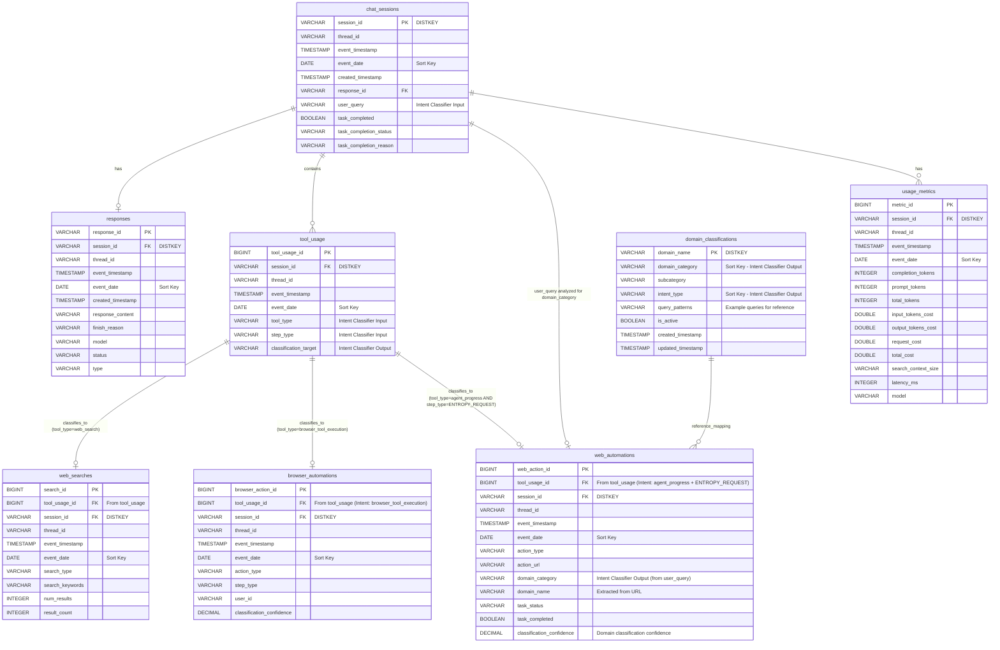

# Entity-Relationship (ER) Diagram
## Redshift Chat Analytics Schema

This document provides an Entity-Relationship diagram of the Redshift schema for chat analytics, including the intent classifier workflow.

---

## Mermaid ER Diagram



---

## Text-Based ER Diagram

```
┌─────────────────────────────────────────────────────────────────────────┐
│                         CHAT ANALYTICS SCHEMA                           │
│                         Entity-Relationship Diagram                      │
└─────────────────────────────────────────────────────────────────────────┘

┌─────────────────────┐
│   chat_sessions     │ ◄───────┐
│  ────────────────   │         │
│ PK session_id       │         │ One-to-Many
│    thread_id        │         │
│    event_timestamp  │         │
│    event_date       │         │
│ FK response_id      │────┐    │
│    task_completed   │    │    │
└─────────────────────┘    │    │
                           │    │
┌─────────────────────┐    │    │
│     responses       │    │    │
│  ────────────────   │    │    │
│ PK response_id      │◄────┘    │
│ FK session_id      │           │
│    thread_id        │           │
│    response_content │           │
│    model            │           │
│    status           │           │
└─────────────────────┘           │
                                   │
┌─────────────────────┐           │
│    tool_usage       │◄──────────┘
│  ────────────────   │
│ PK tool_usage_id    │ ───────────────┐
│ FK session_id       │                 │ Intent Classifier
│    thread_id        │                 │ Routes based on:
│    tool_type        │                 │ - tool_type
│    step_type        │                 │ - step_type
│    classification_  │                 │
│      target         │                 │
└─────────────────────┘                 │
         │                               │
         │                               │
    ┌────┴────┬────────────┬────────────┘
    │         │            │
    ▼         ▼            ▼
┌──────────┐ ┌──────────────┐ ┌──────────────┐
│web_searches│ │browser_      │ │web_          │
│            │ │automations   │ │automations   │
│──────────│ │──────────────│ │──────────────│
│PK search_id│ │PK browser_   │ │PK web_action_│
│FK tool_    │ │  action_id   │ │  id          │
│  usage_id  │ │FK tool_usage_│ │FK tool_usage_│
│    search_ │ │  id          │ │  id          │
│    type    │ │    action_   │ │    action_   │
│            │ │    type      │ │    type      │
│            │ │    user_id   │ │    action_url│
│            │ │              │ │    domain_   │
│            │ │              │ │    category  │
└──────────┘ └──────────────┘ └──────────────┘
┌─────────────────────┐
│   usage_metrics     │
│  ────────────────   │
│ PK metric_id       │
│ FK session_id      │
│    total_tokens     │
│    total_cost       │
│    model            │
└─────────────────────┘

┌─────────────────────┐
│domain_              │
│classifications      │
│─────────────────────│
│PK domain_name       │◄──────┐
│    domain_category  │       │
│    subcategory      │       │ Lookup Reference
│    intent_type      │       │ (Used by ETL to
│    is_active        │       │  populate domain_)
└─────────────────────┘       │  category in:
         │                     │  - web_automations
         │                     │  - browser_history
         │                     │  - search_results
         └─────────────────────┘
```

---

## Intent Classifier Workflow

```
┌─────────────────────────────────────────────────────────────────┐
│                    INTENT CLASSIFIER WORKFLOW                    │
└─────────────────────────────────────────────────────────────────┘

1. RAW DATA (from topic message)
   └─> reasoning_steps[] array
        │
        ▼
2. INSERT INTO tool_usage
   ├─ tool_type = 'web_search'
   ├─ tool_type = 'browser_tool_execution'
   └─ tool_type = 'agent_progress'
        │
        ▼
3. INTENT CLASSIFIER
   ├─ Input: tool_type + step_type
   ├─ Process: Classification logic
   └─ Output: classification_target
        │
        ├─ tool_type = 'web_search'
        │   └─> INSERT INTO web_searches
        │       └─> INSERT INTO search_results (multiple rows)
        │
        ├─ tool_type = 'browser_tool_execution'
        │   └─> INSERT INTO browser_automations
        │
        └─ tool_type = 'agent_progress' AND step_type = 'ENTROPY_REQUEST'
            └─> INSERT INTO web_automations
                └─> Lookup domain_classifications
                    └─> Populate domain_category
```

---

## Relationship Summary

### One-to-Many Relationships:

1. **chat_sessions** → **responses** (1:0..1)
   - One session can have zero or one response
   - FK: `chat_sessions.response_id` → `responses.response_id`

2. **chat_sessions** → **tool_usage** (1:N)
   - One session contains many tool usage events
   - FK: `tool_usage.session_id` → `chat_sessions.session_id`

3. **tool_usage** → **web_searches** (1:0..1)
   - One tool usage can result in one web search
   - FK: `web_searches.tool_usage_id` → `tool_usage.tool_usage_id`
   - **Intent Classifier**: `tool_type = 'web_search'`

4. **tool_usage** → **browser_automations** (1:0..1)
   - One tool usage can result in one browser automation
   - FK: `browser_automations.tool_usage_id` → `tool_usage.tool_usage_id`
   - **Intent Classifier**: `tool_type = 'browser_tool_execution'`

5. **tool_usage** → **web_automations** (1:0..1)
   - One tool usage can result in one web automation
   - FK: `web_automations.tool_usage_id` → `tool_usage.tool_usage_id`
   - **Intent Classifier**: `tool_type = 'agent_progress' AND step_type = 'ENTROPY_REQUEST'`

6. **chat_sessions** → **usage_metrics** (1:N)
   - One session can have multiple usage metric records
   - FK: `usage_metrics.session_id` → `chat_sessions.session_id`

### Lookup Relationships (via ETL):

7. **domain_classifications** → **web_automations** (lookup)
   - Domain name lookup during ETL to populate `domain_category`
   - Lookup: `web_automations.domain_name` → `domain_classifications.domain_name`

---

## Key Design Features

### Distribution Keys (DISTKEY):
- All fact tables use `session_id` as DISTKEY for efficient JOINs
- `domain_classifications` uses `domain_name` as DISTKEY (lookup table)

### Sort Keys (SORTKEY):
- Time-series tables: `event_date` as first sort key
- Composite sort keys for common query patterns
- Example: `SORTKEY(event_date, domain_category, action_type)`

### Intent Classifier Integration:
- **Source**: `tool_usage` table (all events stored here first) + `chat_sessions.user_query`
- **Two-Stage Classification**:
  1. **Tool Routing**: Based on `tool_type` and `step_type`
     - `tool_type='web_search'` → `web_searches` (result_count stored in web_searches)
     - `tool_type='browser_tool_execution'` → `browser_automations`
     - `tool_type='agent_progress' AND step_type='ENTROPY_REQUEST'` → `web_automations`
  2. **Domain Classification**: Based on `user_query` analysis (for `web_automations`)
     - Intent classifier analyzes `user_query` from `request_body`
     - Outputs `domain_category` (Shopping, Booking, Entertainment, Work, Education, Finance)
     - Outputs `intent_type` (Transactional, Informational, Social, Entertainment, Productivity)
- **Tracking**: `classification_target`, `classification_confidence`, and `domain_category` fields

---

## Notes

1. **Foreign Key Constraints**: Redshift doesn't enforce FK constraints, but relationships are maintained logically through ETL
2. **Denormalization**: `session_id` and `thread_id` are denormalized across tables for better JOIN performance
3. **ETL Workflow**: Intent classifier runs before table inserts, routing data to appropriate tables
4. **Domain Classification**: Lookup happens during ETL, not via SQL JOINs at query time
5. **Simplified Schema**: `browser_history` and `search_results` tables removed - search result count stored directly in `web_searches.result_count`

---

## Visualization Tools

This diagram can be rendered using:
- **Mermaid**: View in GitHub, GitLab, or Mermaid Live Editor
- **VS Code**: With Mermaid preview extension
- **Online**: https://mermaid.live/

For text-based viewing, see the ASCII diagram above.

